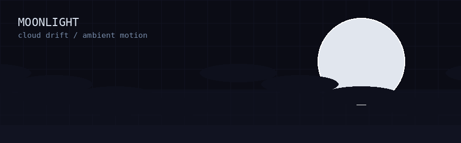
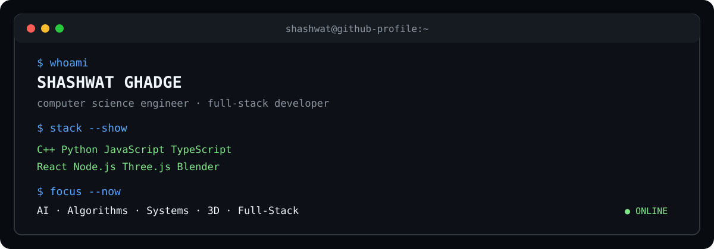

# SHASHWAT GHADGE

### Computer Science Engineer · Full-Stack Developer · AI & 3D Enthusiast

**I build software that works, looks sharp, and has a reason to exist.**

  
  
  
  

 

 

> **Build · Experiment · Learn · Ship**

---

## About

I'm a Computer Science Engineering student focused on building practical software across **full-stack development, AI, algorithms, and 3D experiences**.

I enjoy turning ideas into working products, experimenting with new technologies, and making complex concepts easier to understand through interactive interfaces.

---

## Tech Arsenal

### ⚙️ Languages

`C` `C++` `Python` `JavaScript` `TypeScript`

### 🌐 Web & Backend

`React` `Node.js` `Express` `Vite` `Tailwind CSS` `Three.js` `GSAP`

### 🎨 3D & Creative Development

`Blender` `Three.js`

### 🛠️ Tools & Workflow

`Git` `GitHub` `VS Code` `Vercel`

---

## Engineering Focus

I prefer projects that combine **useful functionality with strong visual experiences**, while keeping performance and maintainability in mind.

---

## Currently

- Learning **C++** and strengthening problem-solving fundamentals
- Exploring deeper systems-level programming and rendering concepts
- Practicing algorithms and competitive programming
- Continuing to develop skills across AI, full-stack development, and 3D

---

## GitHub Activity

 

---

## Connect

  

  Thanks for stopping by.

