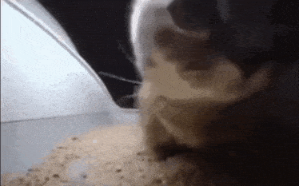

<div align="center">



# SHASHWAT GHADGE

**Computer Science Engineer · Full-Stack Developer · AI & 3D Enthusiast**

Building interactive software, developer tools, AI projects, and visual experiences.

</div>

<p align="center">
  <a href="https://github.com/Shashwat220605"></a>
  
  
  
  
</p>

---

## About

I'm a Computer Science Engineering student focused on building practical software across **full-stack development, AI, algorithms, and 3D experiences**.

I enjoy turning ideas into working products, experimenting with new technologies, and making complex concepts easier to understand through interactive interfaces.

---

## Tech Stack

**Languages**  
`C` `C++` `Python` `JavaScript`

**Web & Backend**  
`React` `Node.js` `Express` `Vite` `Tailwind CSS` `Three.js` `GSAP`

**3D & Creative Development**  
`Blender` `Three.js`

**Tools**  
`Git` `GitHub` `VS Code` `Vercel`

---

## Selected Work

| Project | Description |
|:--|:--|
| **[AlgoVerse](https://github.com/Shashwat220605/AlgoVerse)** | Interactive DSA learning platform with algorithm visualization, execution controls, code highlighting, notes, and practice tools. |
| **NOVA AI Assistant** | Desktop AI and automation project focused on useful local workflows and developer productivity. |
| **[Jett](https://github.com/Shashwat220605/Jett)** | Programming-language project exploring language design, parsing, type checking, tooling, and developer experience. Currently under development. |
| **[Periodic Table 3D](https://periodic-table-3-d.vercel.app/)** | Interactive 3D learning experience for exploring chemical elements and periodic trends. |
| **[Devora](https://github.com/Shashwat220605/Devora)** | AI developer workspace combining project-aware assistance, code execution, GitHub workflows, source control, PR reviews, deployment checks, and persistent project memory. |

### Live Projects

**[AlgoVerse →](https://algo-verse-seven.vercel.app/)** · **[Periodic Table 3D →](https://periodic-table-3-d.vercel.app/)** · **[Devora →](https://devora-rose.vercel.app/)**

---

## Currently Learning

- Generative AI & AI application development
- Machine Learning
- Advanced React and interactive web experiences
- Algorithms and system design
- Cloud technologies

---

## Development Philosophy

```text
IDEA → BUILD → TEST → IMPROVE → SHIP → REPEAT
```

I prefer projects that combine **useful functionality with strong visual experiences**, while keeping performance and maintainability in mind.

---

## Connect

<p align="center">
  <a href="https://github.com/Shashwat220605">GitHub</a> · Explore my projects and experiments
</p>

<p align="center">
  <sub>Thanks for stopping by.</sub>
</p>
